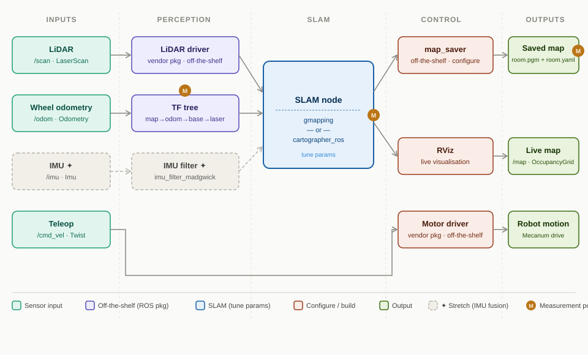

# 🗺️ Room-Mapping Explorer

> Autonomous 2-D occupancy-grid mapping with a JetRover, ROS, LiDAR, and SLAM —
> visualised live in RViz.

---

## Table of Contents

- [🗺️ Room-Mapping Explorer](#️-room-mapping-explorer)
  - [Table of Contents](#table-of-contents)
  - [Project Overview](#project-overview)
  - [Problem Statement](#problem-statement)
  - [Goals \& Success Criteria](#goals--success-criteria)
  - [Architechture Diagram](#architechture-diagram)
  - [Hardware Requirements](#hardware-requirements)
  - [Software Requirements](#software-requirements)
  - [ROS Packages \& Dependencies](#ros-packages--dependencies)
  - [Key Concepts Covered](#key-concepts-covered)
  - [Project Milestones](#project-milestones)
    - [Milestone 1 — Environment Setup](#milestone-1--environment-setup)
    - [Milestone 2 — TF Tree \& URDF](#milestone-2--tf-tree--urdf)
    - [Milestone 3 — Calibration](#milestone-3--calibration)
    - [Milestone 4 — Teleoperation](#milestone-4--teleoperation)
    - [Milestone 5 — SLAM Integration (slam\_toolbox)](#milestone-5--slam-integration-slam_toolbox)
    - [Milestone 6 — Parameter Tuning \& Evaluation](#milestone-6--parameter-tuning--evaluation)
    - [Milestone 7 — Stretch: Cartographer](#milestone-7--stretch-cartographer)
    - [Milestone 8 — Stretch: IMU Fusion](#milestone-8--stretch-imu-fusion)
  - [Directory Structure](#directory-structure)
  - [Getting Started](#getting-started)
  - [Known Limitations \& Future Extensions](#known-limitations--future-extensions)
  - [References](#references)

---

## Project Overview

Room-Mapping Explorer is a ROS-based autonomous mapping project built on the
**HiWonder JetRover** platform (NVIDIA Jetson + LiDAR + Mecanum chassis).
The robot is teleoperated or driven autonomously around an indoor environment
while a SLAM algorithm builds a 2-D occupancy-grid map in real time.
The resulting map is saved to disk and can be re-used for subsequent
autonomous navigation tasks.

This is the **first project** in a progressive JetRover robotics series and
is deliberately scoped to solidify core ROS fundamentals before tackling
more complex subsystems.

---

## Problem Statement

When a mobile robot enters an unknown indoor environment it has no prior
knowledge of the space — walls, doorways, furniture, or free floor area.
Without a map, higher-level behaviours such as autonomous navigation,
delivery, or search-and-rescue are impossible.

**The challenge:** Given a mobile platform equipped with a 2-D LiDAR and
wheel odometry, construct an accurate, real-time occupancy-grid map of an
indoor room or apartment using SLAM, and visualise the map as it is built.

Constraints:
- The environment is unknown and unstructured (typical home/office).
- The robot must handle wheel-slip and sensor noise gracefully.
- The pipeline must run on the onboard Jetson (edge compute, no cloud).
- The map must be exportable in a format compatible with the ROS
  `map_server` / `nav2_map_server` for future navigation projects.

---

## Goals & Success Criteria

| # | Goal | Success Criterion |
|---|------|-------------------|
| 1 | Real-time SLAM | Occupancy grid updates at ≥ 1 Hz in RViz with no noticeable lag |
| 2 | Accurate map | Walls and obstacles visible as solid cells; free space clearly distinct |
| 3 | Full room coverage | ≥ 90 % of the drivable floor area mapped in a single session |
| 4 | Map persistence | Saved `.pgm` / `.yaml` pair loadable by `map_server` |
| 5 | TF tree correct | `odom → base_link → laser` transform chain resolves without errors |
| 6 | IMU fusion (stretch) | Fusing IMU data reduces odometry drift on hard-floor surfaces |

---

## Architechture Diagram



> ✦ Stretch goal — IMU fusion is optional and not required for the MVP.

---

## Hardware Requirements

| Component | Details |
|-----------|---------|
| Robot platform | HiWonder JetRover (Orin Nano Version) — Mecanum or Ackermann chassis |
| Compute | NVIDIA Jetson Orin Nano (onboard) |
| LiDAR | YDLiDAR G4 (default) or YDLiDAR A1 — confirm your unit's version via the config tool |
| IMU | Onboard IMU (for odometry fusion — stretch goal) |
| Depth camera | 3D depth camera (available on platform; not used in MVP) |
| Host PC | Ubuntu 22.04 machine for RViz visualisation (optional) |
| Network | Wi-Fi or Ethernet for SSH access |

---

## Software Requirements

| Software | Version | Notes |
|----------|---------|-------|
| Ubuntu | 22.04 LTS | Pre-installed on Jetson Orin Nano |
| ROS | ROS 2 Humble | Natively installed (not Docker) on Orin Nano version |
| Python | 3.10+ | ROS 2 Humble default |
| C++ | 17 | For any custom nodes |
| RViz2 | Humble | Visualisation |
| Git | 2.x | Version control |

> **Note:** The Orin Nano version ships with **ROS 2 Humble** natively on Ubuntu 22.04 — no Docker required. The older Jetson Nano version uses ROS 1 Noetic. All commands and packages in this README are ROS 2.

---

## ROS Packages & Dependencies

```bash
# Core SLAM — choose one
sudo apt install ros-humble-slam-toolbox        # recommended for ROS 2 (replaces gmapping)
sudo apt install ros-humble-cartographer-ros    # graph-based SLAM (more accurate, stretch goal)

# Map saving & serving
sudo apt install ros-humble-nav2-map-server

# Teleoperation
sudo apt install ros-humble-teleop-twist-keyboard

# TF utilities
sudo apt install ros-humble-tf2-tools ros-humble-tf2-ros

# IMU filter (stretch goal)
sudo apt install ros-humble-imu-filter-madgwick

# Visualisation
sudo apt install ros-humble-rviz2

# YDLiDAR driver
sudo apt install ros-humble-ydlidar-ros2-driver
```

Vendor / platform packages (provided by HiWonder):
- `jetrover_bringup` — launches motor drivers, LiDAR driver, URDF
- `jetrover_description` — URDF / XACRO robot model
- `jetrover_teleop` — joystick / keyboard bindings

---

## Key Concepts Covered

- **ROS 2 Topics & Nodes** — publisher/subscriber pattern for sensor data
- **TF2 Transform Tree** — `map → odom → base_link → laser` chain
- **Occupancy Grid** (`nav_msgs/OccupancyGrid`) — probabilistic map representation
- **SLAM** — Simultaneous Localisation and Mapping (`slam_toolbox`)
- **Odometry** (`nav_msgs/Odometry`) — dead-reckoning from wheel encoders
- **Launch Files** — composing multi-node systems declaratively (Python-based in ROS 2)
- **RViz2 Configuration** — custom `.rviz` files for repeatable visualisation
- **nav2_map_server** — persisting maps to `.pgm` / `.yaml` for re-use

---

## Project Milestones

### Milestone 1 — Environment Setup
- [ ] Confirm Ubuntu 22.04 + ROS 2 Humble is running on the Jetson Orin Nano
- [ ] Clone this repository into `~/ros2_ws/src/`
- [ ] Disable the HiWonder auto-start service before any development session:
      `sudo systemctl stop start_app_node.service`
- [ ] Verify JetRover bringup launches without errors
- [ ] Confirm `/scan` topic publishes LiDAR data (`ros2 topic echo /scan`)
- [ ] Confirm `/odom` topic publishes odometry data (`ros2 topic echo /odom`)
- [ ] Confirm YDLiDAR model (G4 or A1) via the robot config tool and update `config/` accordingly

**Depends on:** nothing

**Done when:**
- `ros2 topic echo /scan` shows live data at ~10 Hz with no gaps
- `ros2 topic echo /odom` shows live odometry with a populated covariance matrix (not all zeros)
- `jetrover_bringup` launches without errors or warnings
- YDLiDAR model confirmed (G4 or A1) and recorded in `config/`

### Milestone 2 — TF Tree & URDF
- [ ] Load `jetrover_description` and verify URDF with `check_urdf`
- [ ] Visualise TF tree using `ros2 run tf2_tools view_frames`
- [ ] Confirm `base_link → laser` static transform is correct

**Depends on:** Milestone 1

**Done when:**
- `ros2 run tf2_tools view_frames` produces a PDF with the full chain: `odom → base_link → laser_frame`
- No "could not find transform" warnings in any node logs
- `base_link → laser_frame` offset matches the physical mounting position (measure and verify)

### Milestone 3 — Calibration
- [ ] Run IMU calibration per HiWonder tutorial section 2.5
- [ ] Run linear velocity and angular velocity calibration
- [ ] Verify calibration reduces odometry drift before proceeding to SLAM

**Depends on:** Milestone 2

**Done when:**
- IMU calibration completed per HiWonder tutorial section 2.5
- Linear and angular velocity calibrated; robot travels ~1 m straight and returns to within ~5 cm
- Odometry drift over a short loop (~3 m) is acceptable before SLAM correction

### Milestone 4 — Teleoperation
- [ ] Drive robot with `ros2 launch peripherals teleop_key_control.launch.py`
- [ ] Confirm `/cmd_vel` commands move the physical robot
- [ ] Tune linear/angular speed limits in config (reduce speed for mapping sessions)

**Depends on:** Milestone 1 (can run in parallel with Milestones 2 and 3)

**Done when:**
- Robot moves in correct direction for all 4 Mecanum drive directions (strafe included)
- `/cmd_vel` commands visible in `ros2 topic echo /cmd_vel` while driving
- Speed limits tuned to a safe mapping speed (slow enough to avoid scan blur)

### Milestone 5 — SLAM Integration (slam_toolbox)
- [ ] Stop auto-start service (`sudo systemctl stop start_app_node.service`)
- [ ] Launch `slam_toolbox` in online async mode
- [ ] Open RViz2 and add `/map` and `/scan` displays
- [ ] Drive robot around room and observe map building in real time
- [ ] Save map with the correct command (note the required `--ros-args` flag):
      `ros2 run nav2_map_server map_saver_cli -f "room_map" --ros-args -p map_subscribe_transient_local:=true`
- [ ] Verify map is saved to `~/ros2_ws/src/slam/maps/` (HiWonder default path)

**Depends on:** Milestones 2, 3, 4

**Done when:**
- `/map` topic publishes at ≥ 1 Hz visible in RViz2 with no lag
- Driving a closed loop (~3 m square) produces a recognisably square map with walls aligned
- Map saved successfully: `.pgm` and `.yaml` files loadable by `map_server`
- `map_subscribe_transient_local:=true` flag confirmed to prevent `map_saver_cli` from hanging

### Milestone 6 — Parameter Tuning & Evaluation
- [ ] Compare maps from multiple runs; identify drift or artefacts
- [ ] Tune key `slam_toolbox` params (`resolution`, `minimum_travel_distance`, `minimum_travel_heading`)
- [ ] Document best-performing parameter set in `config/slam_toolbox_params.yaml`

**Depends on:** Milestone 5

**Done when:**
- At least 3 mapping runs completed and compared
- Best-performing parameter set documented in `config/slam_toolbox_params.yaml`
- ≥ 90% of drivable floor area mapped in a single session (Success Criterion #3)

### Milestone 7 — Stretch: Cartographer
- [ ] Replace `slam_toolbox` with `cartographer_ros`
- [ ] Write Cartographer `.lua` configuration file
- [ ] Compare map quality vs `slam_toolbox`; document findings

**Depends on:** Milestone 5

**Done when:**
- Cartographer produces a comparable map to slam_toolbox
- Qualitative comparison documented in `docs/parameter_tuning.md`

### Milestone 8 — Stretch: IMU Fusion
- [ ] Launch `imu_filter_madgwick` to fuse IMU + odometry
- [ ] Verify improved localisation on slippery (hard) floor surfaces

**Depends on:** Milestone 5

**Done when:**
- `imu_filter_madgwick` running and `/imu/data` publishing
- Measurable reduction in odometry drift over a closed loop on hard floor

---

## Directory Structure

```
room-mapping-explorer/
├── README.md
├── CMakeLists.txt
├── package.xml
│
├── config/
│   ├── slam_toolbox_params.yaml   # Tuned slam_toolbox parameters
│   ├── cartographer_config.lua    # Cartographer config (stretch)
│   └── rviz/
│       └── mapping.rviz           # Saved RViz2 layout
│
├── launch/
│   ├── mapping.launch.py          # Main entry point: bringup + SLAM + RViz2
│   ├── slam_toolbox.launch.py     # SLAM only (slam_toolbox)
│   ├── cartographer.launch.py     # SLAM only (cartographer, stretch)
│   └── teleop.launch.py           # Keyboard teleoperation
│
├── maps/
│   └── .gitkeep                   # Saved maps go here (gitignored)
│
├── nodes/
│   └── (custom Python/C++ nodes if needed)
│
├── urdf/
│   └── (symlink or copy of jetrover URDF for reference)
│
└── docs/
    ├── architecture.md
    ├── parameter_tuning.md
    └── images/
        └── pipeline.svg
```

---

## Getting Started

```bash
# 1. SSH into the Jetson
ssh jetson@<JETROVER_IP> #TODO

# 2. Disable HiWonder auto-start service (required before any dev session)
sudo systemctl stop start_app_node.service

# 3. Clone the repo
cd ~/ros2_ws/src
git clone https://github.com/<your-username>/room-mapping-explorer.git #TODO

# 4. Install dependencies
cd ~/ros2_ws
rosdep install --from-paths src --ignore-src -r -y

# 5. Build
colcon build --symlink-install
source install/setup.bash

# 6. Launch mapping session
ros2 launch room-mapping-explorer mapping.launch.py

# 7. In a new terminal — drive the robot
ros2 launch peripherals teleop_key_control.launch.py

# 8. When done, save the map (--ros-args flag required to avoid map saver hanging)
ros2 run nav2_map_server map_saver_cli -f "room_map" --ros-args -p map_subscribe_transient_local:=true
# Maps are saved to ~/ros2_ws/src/slam/maps/ by default
```

---

## Known Limitations & Future Extensions

**Current limitations (MVP scope):**
- 2-D mapping only — no vertical structure captured
- Relies on wheel odometry which drifts on smooth floors
- Manual teleoperation required; no autonomous exploration
- Single-session only — no map merging across sessions

**Planned extensions (future projects):**
- **Autonomous Navigation** — use the saved map with `nav2` for
  point-to-point navigation (Project #2 in the series)
- **Frontier Exploration** — autonomous coverage using `explore_lite`
- **3-D Mapping** — integrate the Dabai DCW depth camera with `rtabmap_ros` (RTAB-VSLAM, already supported by HiWonder)
- **Multi-floor** — elevator / staircase traversal and map stitching

---

## References

- [ROS 2 Humble Documentation](https://docs.ros.org/en/humble/)
- [slam_toolbox Wiki](https://github.com/SteveMacenski/slam_toolbox)
- [Google Cartographer ROS](https://google-cartographer-ros.readthedocs.io/)
- [nav_msgs/OccupancyGrid](https://docs.ros.org/en/humble/p/nav_msgs/)
- [TF2 ROS 2 Tutorial](https://docs.ros.org/en/humble/Tutorials/Intermediate/Tf2/Tf2-Main.html)
- [YDLiDAR ROS 2 Driver](https://github.com/YDLIDAR/ydlidar_ros2_driver)
- [HiWonder JetRover Orin Nano Docs](https://docs.hiwonder.com/projects/JetRover/en/jetson-orin-nano/)
- Thrun, S., Burgard, W., Fox, D. — *Probabilistic Robotics* (MIT Press, 2005)