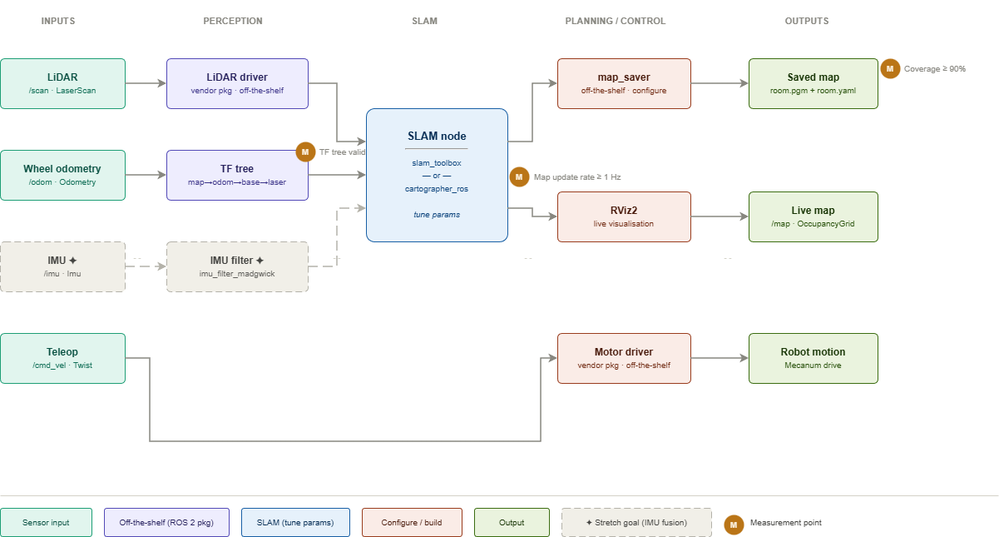

# Room-Mapping Explorer

Teleoperated 2-D occupancy-grid mapping with a JetRover, ROS 2, LiDAR, and SLAM — visualised live in RViz2.

---

## Project Overview

Drive the HiWonder JetRover around a room while `slam_toolbox` builds a 2-D occupancy-grid map from LiDAR scans and wheel odometry. Save the map to disk when done.

This is the first project in a progressive JetRover series. The goal is to get a working SLAM pipeline on real hardware — nothing more.

---

## Problem Statement

The robot enters an unknown room with no prior map. Using its LiDAR and wheel odometry, it must build a 2-D map in real time that can be saved and reused for future navigation.

---

## Goals & Success Criteria

| Goal | Done when |
|------|-----------|
| LiDAR and odometry data flowing | `/scan` and `/odom` publishing on the Jetson |
| TF tree correct | `map -> odom -> base_link -> laser` resolves without errors |
| SLAM running | `/map` visible in RViz2, updating as the robot moves |
| Map saved | `.pgm` and `.yaml` files loadable by `map_server` |

---

## Architecture Diagram



---

## Hardware

| Component | Details |
|-----------|---------|
| Robot | HiWonder JetRover (Orin Nano version), Mecanum chassis |
| Compute | NVIDIA Jetson Orin Nano |
| LiDAR | YDLiDAR G4 |
| Host PC | Ubuntu 22.04 with RViz2 (optional, for visualisation) |

---

## Software

| Software | Version |
|----------|---------|
| Ubuntu | 22.04 LTS (on Jetson) |
| ROS 2 | Humble |
| slam_toolbox | Humble |
| nav2_map_server | Humble |
| RViz2 | Humble |

> The Orin Nano version ships with ROS 2 Humble natively — no Docker required.

---

## Dependencies

```bash
sudo apt install ros-humble-slam-toolbox
sudo apt install ros-humble-nav2-map-server
sudo apt install ros-humble-teleop-twist-keyboard
sudo apt install ros-humble-tf2-tools
sudo apt install ros-humble-rviz2
sudo apt install ros-humble-ydlidar-ros2-driver
```

HiWonder packages (pre-installed on the Jetson):
- `jetrover_bringup` — motor drivers, LiDAR driver, URDF
- `jetrover_description` — robot URDF/XACRO
- `jetrover_teleop` — keyboard teleoperation

---

## Milestones

### Milestone 1 — Hardware Bringup
- [ ] Confirm ROS 2 Humble is running on the Jetson
- [ ] Stop the HiWonder auto-start service: `sudo systemctl stop start_app_node.service`
- [ ] Launch `jetrover_bringup` without errors
- [ ] Confirm `/scan` publishes: `ros2 topic echo /scan`
- [ ] Confirm `/odom` publishes: `ros2 topic echo /odom`
- [ ] Confirm your LiDAR model (G4 or A1) via the robot config tool

**Done when:** `/scan` is live at ~10 Hz, `/odom` has a non-zero covariance matrix, bringup is clean.

---

### Milestone 2 — TF Tree
- [ ] Load `jetrover_description` and check URDF: `check_urdf`
- [ ] Visualise the TF tree: `ros2 run tf2_tools view_frames`
- [ ] Confirm `base_link -> laser` offset matches the physical LiDAR mounting position

**Done when:** Full chain `odom -> base_link -> laser` resolves with no transform errors.

---

### Milestone 3 — Calibration
- [ ] Run IMU calibration (HiWonder tutorial section 2.5)
- [ ] Calibrate linear and angular velocity
- [ ] Verify the robot travels ~1 m straight and returns to within ~5 cm

**Done when:** Odometry drift over a short loop is acceptable before SLAM correction kicks in.

---

### Milestone 4 — Teleoperation
- [ ] Drive the robot: `ros2 launch peripherals teleop_key_control.launch.py`
- [ ] Confirm all four Mecanum drive directions work (including strafe)
- [ ] Tune speed to a safe mapping speed (slow enough to avoid scan blur)

**Done when:** Robot moves correctly in all directions, `/cmd_vel` visible while driving.

---

### Milestone 5 — SLAM
- [ ] Launch `slam_toolbox` in online async mode
- [ ] Open RViz2, add `/map` and `/scan` displays
- [ ] Drive the robot around the room and watch the map build
- [ ] Save the map:
  ```bash
  ros2 run nav2_map_server map_saver_cli -f "room_map" --ros-args -p map_subscribe_transient_local:=true
  ```

**Done when:** Driving a closed loop produces a recognisable map; `.pgm` and `.yaml` files saved successfully.

---

### Milestone 6 — Tuning
- [ ] Run at least 3 mapping sessions and compare results
- [ ] Tune key slam_toolbox params (`resolution`, `minimum_travel_distance`, `minimum_travel_heading`)
- [ ] Save the best parameter set to `config/slam_toolbox_params.yaml`

**Done when:** Best parameter set documented; >= 90% of drivable floor area mapped in a single session.

---

## Stretch Goal

The pipeline diagram shows a dashed block for IMU fusion — here is what that means and why it exists:

- **What it is:** Add a physical IMU sensor to the JetRover and run `imu_filter_madgwick`, a ROS 2 package that fuses IMU data with wheel odometry to produce a better `/odom` estimate.
- **Why it helps:** Mecanum wheels slip on smooth floors, which causes wheel odometry to drift. The IMU measures rotational acceleration directly, so it catches drift that the wheels miss — especially during fast turns.
- **What's needed:** A compatible IMU (e.g., MPU-6050 or BNO055), the `robot_localization` or `imu_filter_madgwick` package, and a new node wired into the pipeline between odometry and SLAM.
- **When to attempt it:** After Milestone 6 is complete and the baseline map quality is established — that gives you a clear before/after comparison to see whether fusion actually helps.

---

## Directory Structure

```
room-mapping-explorer/
├── README.md
├── config/
│   ├── slam_toolbox_params.yaml
│   └── rviz/
│       └── mapping.rviz
├── launch/
│   ├── mapping.launch.py        # bringup + SLAM + RViz2
│   └── teleop.launch.py
├── maps/                        # saved maps (gitignored)
└── docs/
    ├── architecture.md
    └── images/
        └── pipeline.svg
```

---

## Getting Started

```bash
# SSH into the Jetson
ssh jetson@<JETROVER_IP>

# Stop the auto-start service
sudo systemctl stop start_app_node.service

# Clone the repo
cd ~/ros2_ws/src
git clone https://github.com/<your-username>/room-mapping-explorer.git

# Install dependencies
cd ~/ros2_ws
rosdep install --from-paths src --ignore-src -r -y

# Build
colcon build --symlink-install
source install/setup.bash

# Launch a mapping session
ros2 launch room-mapping-explorer mapping.launch.py

# In a second terminal — drive the robot
ros2 launch peripherals teleop_key_control.launch.py

# When done, save the map
ros2 run nav2_map_server map_saver_cli -f "room_map" --ros-args -p map_subscribe_transient_local:=true
```
---

## Things to Check Early

**QoS mismatch** — slam_toolbox can silently receive nothing from `/scan` if the QoS profiles don't match. Verify:
```bash
ros2 topic info /scan --verbose
```

**Laser frame name** — the frame ID stamped on `/scan` messages must match the laser frame in the URDF. Check:
```bash
ros2 topic echo /scan --once | grep frame_id
```

**Odometry covariance** — slam_toolbox uses the covariance matrix on `/odom`. If it's all zeros, SLAM will behave unpredictably. Check:
```bash
ros2 topic echo /odom --once | grep -A 36 covariance
```

**Map saver flag** — always use `--ros-args -p map_subscribe_transient_local:=true` or `map_saver_cli` will hang waiting for a message it never receives.

---

## Limitations

- 2-D only — no vertical structure
- Wheel odometry drifts on smooth floors
- Requires manual teleoperation (no autonomous exploration)

---

## References

- [ROS 2 Humble Docs](https://docs.ros.org/en/humble/)
- [slam_toolbox](https://github.com/SteveMacenski/slam_toolbox)
- [YDLiDAR ROS 2 Driver](https://github.com/YDLIDAR/ydlidar_ros2_driver)
- [HiWonder JetRover Docs](https://docs.hiwonder.com/projects/JetRover/en/jetson-orin-nano/)
