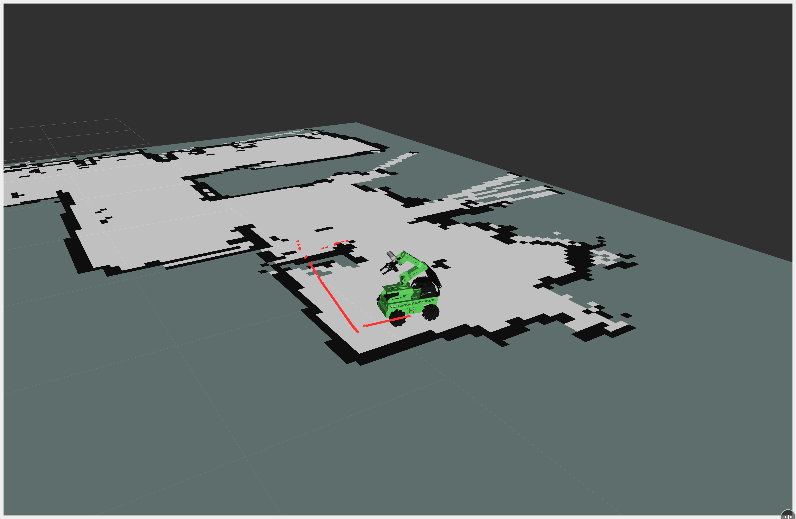
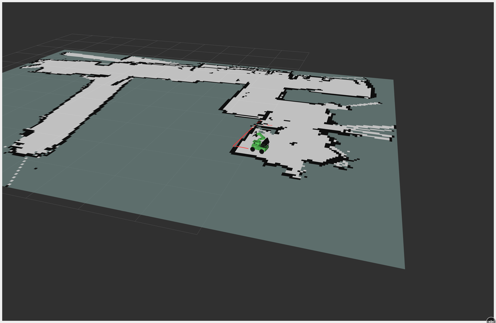
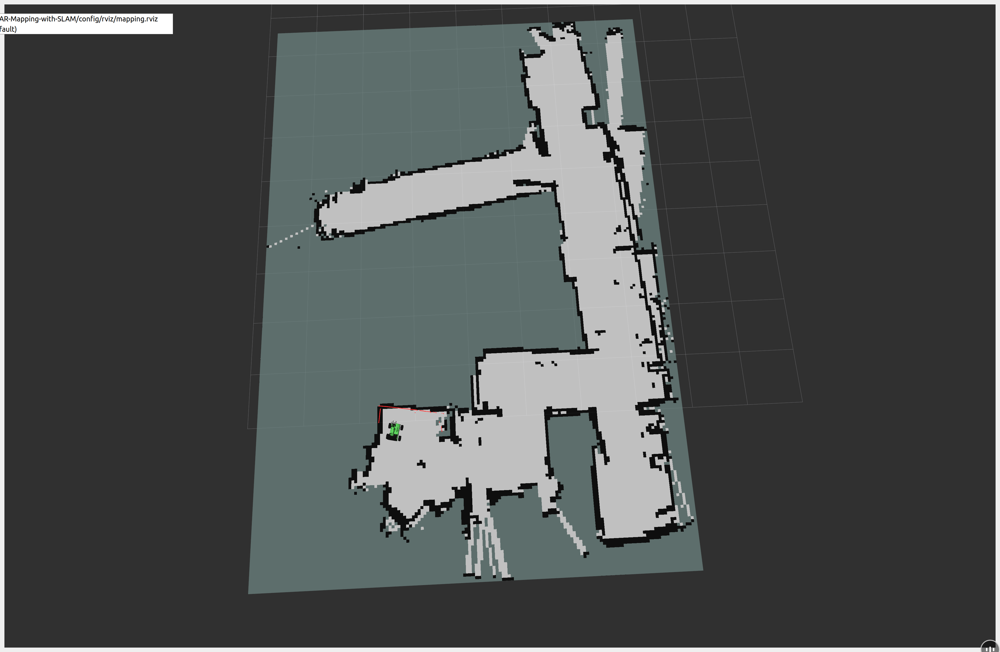
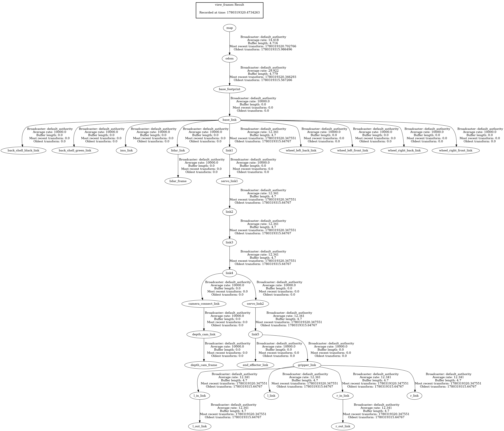

# 2D-LiDAR-Mapping-with-SLAM

Teleoperated 2-D occupancy-grid mapping with a JetRover, ROS 2, LiDAR, and SLAM — visualised live in RViz2.

---

## Project Overview

Drive the HiWonder JetRover around a room while `slam_toolbox` builds a 2-D occupancy-grid map from LiDAR scans and wheel odometry. Save the map to disk when done.

This is the first project in a progressive JetRover series. The goal is to get a working SLAM pipeline on real hardware — nothing more.

---

## Problem Statement

The robot enters an unknown room with no prior map. Using its LiDAR and wheel odometry, it must build a 2-D map in real time that can be saved and reused for future navigation.

---

## Hardware

| Component | Details |
|-----------|---------|
| Robot | HiWonder JetRover (Orin Nano version), Mecanum chassis |
| Compute | NVIDIA Jetson Orin Nano |
| LiDAR | SLAMTEC RPLidar A1 |

---

## Software

| Machine | Ubuntu | ROS 2 |
|---------|--------|-------|
| Jetson Orin Nano | 22.04 LTS | Humble |
| Host (dev machine) | 22.04 LTS | Humble |

The robot stack runs entirely on the Jetson. The host connects over DDS for visualization (RViz2) only.

---

## Architecture


See [`docs/architecture.md`](docs/architecture.md) for a full description of the pipeline.

---

## Directory Structure

```
2D-LiDAR-Mapping-with-SLAM/
├── config/
│   ├── slam_toolbox_params.yaml
│   └── rviz/
│       └── mapping.rviz
├── two_d_lidar_mapping_with_slam/
│   └── __init__.py
├── launch/
│   └── mapping.launch.py        # controller + arm init + LiDAR + joystick + SLAM
├── maps/                        # saved maps (.pgm, .yaml, .posegraph)
└── docs/
    ├── ROADMAP.md               # goals, success criteria, and milestones
    ├── architecture.md
    └── images/
```

---

## Dependencies

**Sibling ROS 2 package — must be in the same workspace:**

| Package | Repo | Role |
|---------|------|------|
| `jetrover_description` | [jetrover_description](https://github.com/mahersabbagh80/jetrover_description) | URDF + meshes for the JetRover |

**On the Jetson (Humble):**

All dependencies are declared in `package.xml` and installed automatically by `rosdep` (see Getting Started). The key package is `slam_toolbox`. HiWonder packages (`controller`, `peripherals`) are pre-installed on the Jetson and not managed by rosdep.

**On the host (Humble):**
```zsh
sudo apt install ros-humble-rviz2              # for viewing the map
sudo apt install ros-humble-tf2-tools          # optional, for host-side TF debugging
```

---

## Development Workflow

All development runs on the Jetson. The recommended approach is to edit code locally and push to git, then pull and build on the robot.

**Access the robot:**
```zsh
ssh ubuntu@192.168.2.138   # password: ubuntu
```

For visualization, run RViz2 natively on your host machine — it connects to the Jetson over DDS.

> Note: `192.168.2.138` is a DHCP-assigned IP — update this if it changes.

---

## Getting Started

```zsh
# SSH into the Jetson
ssh ubuntu@192.168.2.138

# Stop the auto-start service
sudo systemctl stop start_app_node.service

# Clone both packages into the workspace (if not already present)
cd ~/jetson_ws/src
git clone https://github.com/mahersabbagh80/2D-LiDAR-Mapping-with-SLAM.git
git clone https://github.com/mahersabbagh80/jetrover_description.git

# Install dependencies
cd ~/jetson_ws
rosdep update
rosdep install --from-paths src --ignore-src -r -y

# Build
colcon build --symlink-install
source install/setup.zsh

# Launch the full mapping stack (controller + arm init + LiDAR + joystick + SLAM)
ros2 launch two_d_lidar_mapping_with_slam mapping.launch.py
```

Drive the robot with the gamepad. On the host, open RViz2 with the pre-configured layout:

```zsh
rviz2 -d /config/rviz/mapping.rviz
# or load it via File → Open Config inside RViz2
```

When done, save the map (run on the Jetson while the stack is still up):

```zsh
# Standard map files (.pgm + .yaml) for nav2
ros2 run nav2_map_server map_saver_cli -f /2D-LiDAR-Mapping-with-SLAM/maps/

# Pose graph (.data + .posegraph) — lets you resume mapping in a future session
ros2 service call /slam_toolbox/serialize_map slam_toolbox/srv/SerializePoseGraph \
  "{filename: '/home/ubuntu/jetson_ws/src/2D-LiDAR-Mapping-with-SLAM/maps/apartment'}"
```

---

## Limitations

- 2-D only — no vertical structure
- Wheel odometry drifts on smooth floors, which may result in some inaccurate mappings
- Requires manual teleoperation (no autonomous exploration)

---

## Results

The robot successfully mapped a full apartment in a single session. Rooms, corridors, doorways, and furniture outlines are clearly resolved at 5 cm/cell resolution.

| Robot model with live LiDAR scan | Side view of the apartment |
|---|---|
|  |  |


*Completed apartment map — full floor layout resolved in a single teleoperated session*

### TF Tree

The live TF tree captured during a mapping session with the command: ′ros2 run tf2_tools view_frames′
Matches the expected `map → odom → base_footprint → base_link → lidar_link` chain described in the architecture.



---

## References

- [ROS 2 Humble Docs](https://docs.ros.org/en/humble/)
- [HiWonder JetRover Docs](https://docs.hiwonder.com/projects/JetRover/en/jetson-orin-nano/)
- [HiWonder Course for Mapping & Navigation](https://docs.hiwonder.com/projects/JetRover/en/jetson-orin-nano/docs/4.Mapping_Navigation_Course.html#mapping)
- [Goals & Roadmap](docs/ROADMAP.md)

**Packages used in this project:**

| Package | Type | Role | Docs / Source |
|---------|------|------|---------------|
| `slam_toolbox` | Community | SLAM — builds the map, publishes `map → odom` TF | [GitHub](https://github.com/SteveMacenski/slam_toolbox) |
| `robot_localization` (ekf_filter_node) | Community | Fuses wheel odometry, publishes `odom → base_footprint` TF | [GitHub](https://github.com/cra-ros-pkg/robot_localization) · [Docs](https://docs.ros.org/en/humble/p/robot_localization/) |
| `laser_filters` (scan_to_scan_filter_chain) | Official ROS | Filters raw LiDAR scan before SLAM | [GitHub](https://github.com/ros-perception/laser_filters) · [Docs](https://docs.ros.org/en/humble/p/laser_filters/) |
| `sllidar_ros2` (sllidar_node) | Hardware vendor (SLAMTEC, open source) | RPLidar A1 hardware driver | [GitHub](https://github.com/Slamtec/sllidar_ros2) |
| `ros_robot_controller` | Vendor (HiWonder, **closed source**) | Serial protocol driver to motor board — hardware interface | Pre-installed on Jetson |
| `controller` | Vendor (HiWonder, **closed source**) | Wheel odometry, EKF, servo control, arm init pose | Pre-installed on Jetson |
| `peripherals` | Vendor (HiWonder, **closed source**) | LiDAR driver launch, joystick control node | Pre-installed on Jetson |
